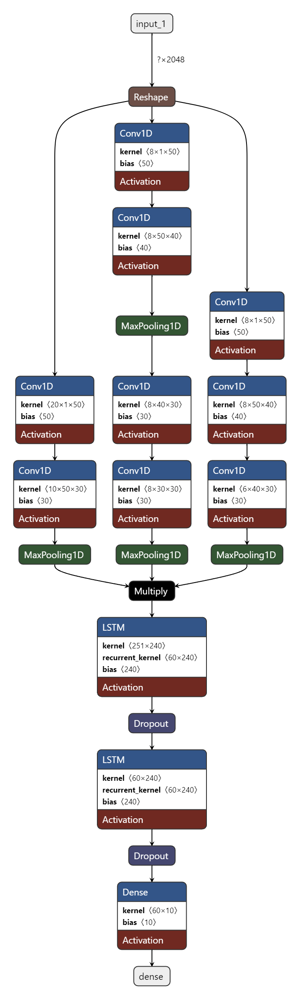

# CWRUPlatform

西储大学轴承数据集故障诊断仿真平台

## 1.简介

该项目构建于**基于深度学习的风电机组机械故障智能识别方法研究**，是一款简易的故障诊断和模型训练的仿真平台，该平台以
**PySide2**
为UI，Tensorflow/keras为算法库开发实现，使用[西储大学轴承数据集](https://www.cnblogs.com/gshang/p/10712809.html)
为训练集和测试集。平台主要功能为以下：

* 选择不同算法训练模型
* 使用保存的模型进行故障诊断
* 利好的可视化指标反馈

## 2.环境

* Windows 10
* python 3.8
* anaconda
* Pycharm
* 其余第三方库见[requirements.txt](requirements.txt)

## 3. 文件说明

* [UI/](UI): 存放的软件平台页面布局文件
* [data_preprocess.py](data_preprocess.py): 数据预处理
* [diagnosis.py](diagnosis.py): 故障诊断相关函数
* [feature_extraction.py](feature_extraction.py): 特征提取函数
* [figure_canvas.py](figure_canvas.py): GraphicsView控件中利用matplotlib绘图的相关函数
* [main.py](main.py): 主程序
* [message_signal.py](message_signal.py): 自定义信号
* [preprocess_train_result.py](preprocess_train_result.py): 处理模性训练结果的相关函数
* [training_model.py](training_model.py) 模型训练的相关函数

## 4. 故障分类算法

算法可以对**0马力，采样频率为48KHZ**的轴承的9类故障以及正常状态进行分类，这9类故障分别为：

* 滚动体故障：0.1778mm
* 滚动体故障：0.3556mm
* 滚动体故障：0.5334mm
* 内圈故障：0.1778mm
* 内圈故障：0.3556mm
* 内圈故障：0.5334mm
* 外圈故障（6点方向）：0.1778mm
* 外圈故障（6点方向）：0.3556mm
* 外圈故障（6点方向）：0.5334mm

平台中一共使用了4种不同的算法来进行故障诊断，这4种算法分别为：

* 1D_CNN

> 

* LSTM

> 

* GRU

> 

* MCNN_LSTM

> 

<!-- 对于故障诊断的算法以及数据的处理，参考了[Jiali Zhang](https://github.com/zhangjiali1201/keras_bearing_fault_diagnosis)的代码。 -->

## 5.效果图

* 页面1（实时诊断）
  
* 页面2（模型训练）
  
* 页面3（查看历史）
  

## 6.说明

1. 对于数据可视化的图片显示，参照[Pyside2中嵌入Matplotlib的绘图](https://blog.csdn.net/qq_28053421/article/details/113828372?spm=1001.2014.3001.5501)
，使用了 GraphicsView控件嵌入Matplotlib的绘图，
而在训练结果展示的图片显示中，由于绘图使用了sklearn中封装的函数，所以目前是将其先存到本地，然后再读取显示。

2. 为保证在使用模型进行 本地诊断/实时诊断 时的准确性，需要对诊断数据利用与模型训练时相同的数据标准化尺度进行标准化处理，
   因此在保存训练模型时，会同时保存一个配置文件（JSON文件），以记录标准化的相关信息。
   同时，为保证配置文件和模型的匹配性，会同时记录模型文件的md5值，以便在加载模型时校验。